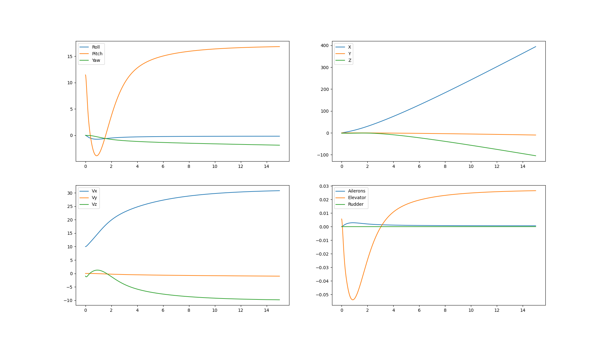

# Wright
Aircraft model simulation system written in Python.

## Dynamics of flight

Dynamics of flight and rigid bodies in general are extremely complicated. I will thus not go into depth on this topic.

### Kinematics

The state of the aircraft can be represented with four three dimensional vectors in the inertial frame of reference:
* $x_i$ - position
* $(\phi, \theta, \psi)$ - attitude as roll-pitch-yaw (X-Y-Z) euler angles

* $v_i$ - linear velocity
* $\omega_i$ - angular velocity

Position can be calculated from linear velocity simply as

$x_i = x_0 + \int_{0}^{t} v_i dt$

Integration of attitude is a bit harder, but can be derived from the equation for their derivative.

$(\dot \phi, \dot \theta, \dot \psi) = L(\phi, \theta, \psi) \omega_i$

### Dynamics

Aircraft is controlled by four main forces, which are thrust, drag, force of gravity and lift.

Thrust is produced by motor, while the force of gravity is constant at $9.82 m / s^2$.

Force of drag and force of lift both depend on the velocity of the surface and the angle of attack.

$F_D = \frac{1}{2} \rho v^2 C_D A$

$F_L = \frac{1}{2} \rho v^2 C_L A$

$C_D$ and $C_L$ are coefficients of lift and depend on the angle of attack $\alpha$ but usually have to be determined experimentally.

To compute all the forces and torques acting on the body, our model consists of seperate surfaces. For each surface it's velocity is calculated $v_s = v_b + \omega_b \times r_s$ where $r_s$ is the surface's position relative to the center of the body in it's reference frame. Using this velocity, angle of attack can be calculated from which $F_D$ and $F_L$ are computed.

Using rigid body kinematics, torques and forces can then be transformed into $\dot \omega_i$ and $\dot v_i$, which are integrated to get $\omega_i$ and $v_i$.

## Results

### Phugoid and Dutch roll

By choosing an inital nose-up attitude with a slight roll, both phugoid oscilations and dutch roll can be observed.

### PD regulator

I also constructed a simple PD regulator to regulate both pitch and roll. Target values were 11 degrees nose and no roll.

